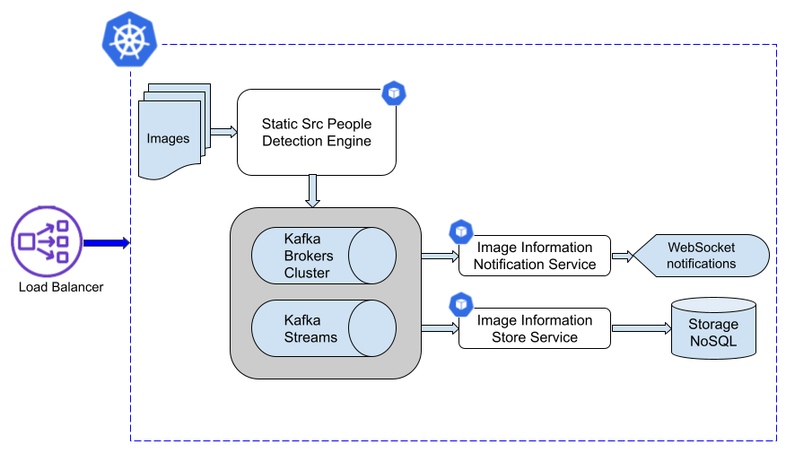

# Static-src-people-detector Helm chart

**Static Source People Detector App**

People detection by images source applications chart.

Below chart applications diagram: 




- Following POST API exposed to start retrieve from folder specified by "folderPath" POST request attribute. Detection engine is applied on available images in folder.
```bash
  Method POST
  http:// {loadBalancer} /api/face/v1/folderFaceDetect
```

Request schema definition:
```yaml
paths:
  /api/face/v1/folderFaceDetect:
    post:
      summary: Start retrieve images, detection information, send information to kafka
      consumes:
        - application/json
      parameters:
        - in: body
          schema:
            type: object
            required:
              - folderPath
            properties:
              folderPath:
                type: string 
```

- Applications communication and data process are asynchronous and use Kafka broker.
- Detection information are saved on mongoDB store. Following API to retrieve information saved on store is exposed.
```bash
  Method GET
  http:// {loadBalancer} /store/imageInformation/retrieve
```

- New detection info available notify are allowed to websocket by exposed web page or ws api.
- People number threshold setting, to start alerts, is available: "min.people.num.threshold" configuration in notification-app.


